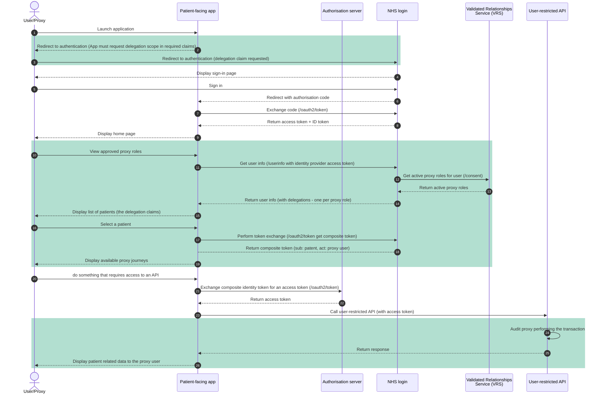



Proxy access to national services is primarily enabled through NHS login, which provides identity assurance and delegated access capabilities for patient-facing applications.

NHS login acts as the federated identity provider for national services. It supports:

- Authentication of the individual user
- Verification of identity to the appropriate level of assurance
- Representation of delegated (proxy) roles
- Secure token issuance for API access

By federating identity and delegation through NHS login, services can rely on a consistent, nationally governed mechanism for determining:

- Who the authenticated user is
- Whether they are acting on their own behalf or as a proxy
- Which patient context applies to subsequent API calls

This approach avoids the need for individual services to implement their own proxy role management and identity verification.

## Related documentation

This documentation is meant to act as a guide for how to implement the proxy access workflow into your application. For concrete integration guidance and specifications for the requisite APIs and onboarding processes, you can refer to the following:

- [NHS login developer documentation](https://nhsconnect.github.io/nhslogin/)
- [User-restricted RESTful APIs - NHS login separate authentication and authorisation](https://digital.nhs.uk/developer/guides-and-documentation/security-and-authorisation/user-restricted-restful-apis-nhs-login-separate-authentication-and-authorisation)

## High-level steps

{{ imagePopOut('/assets/images/federated_access_generic.png' | url, 'Federated access steps') }}

1. A logged-in user of a patient facing service begins a proxy journey.

2. The patient-facing app (PFS) must request `delegation` scope when initiating the auth code flow to authenticate the user.

3. The PFS will then use the issued access token to query NHS login's `/UserInfo` endpoint. This will trigger NHS login to retrieve all active proxy roles for the logged in user from the Validated Relationships Service (VRS). These are returned as claims in the `delegations` array in the response payload and can be presented to the user for selection.

4. When NHS login retrieves proxy roles, it uses the `GET /Consent` endpoint.

5. The user selects who they would like to "switch to" in the app. The PFS must then perform a token exchange with NHS login. NHS login will issue a composite identity token detailing the `sub`ject and the `act`or, the patient and proxy respectively. This token can then be exchanged for an access token.

6. The user performs a transaction on behalf of the patient they are proxying for, with the PFS passing the delegated access token in the request in the `Authorization` header (bearer token). The API will verify the token process the request n te context of the subject in the token, auditing the the request appropriately.

## Detailed steps

The below sequence diagram illustrates how the various components interact in order for a proxy user to complete a task involving an external API on behalf of a patient. The flow follows the standard auth flow described in [User-restricted RESTful APIs - NHS login separate authentication and authorisation](https://digital.nhs.uk/developer/guides-and-documentation/security-and-authorisation/user-restricted-restful-apis-nhs-login-separate-authentication-and-authorisation). Where there is variation from the standard process, these steps are highlighted in green.

