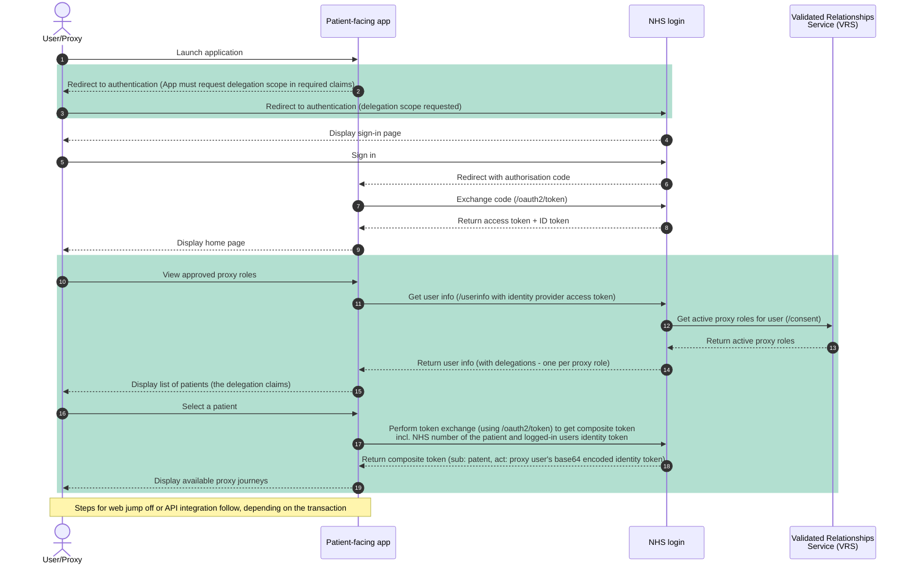
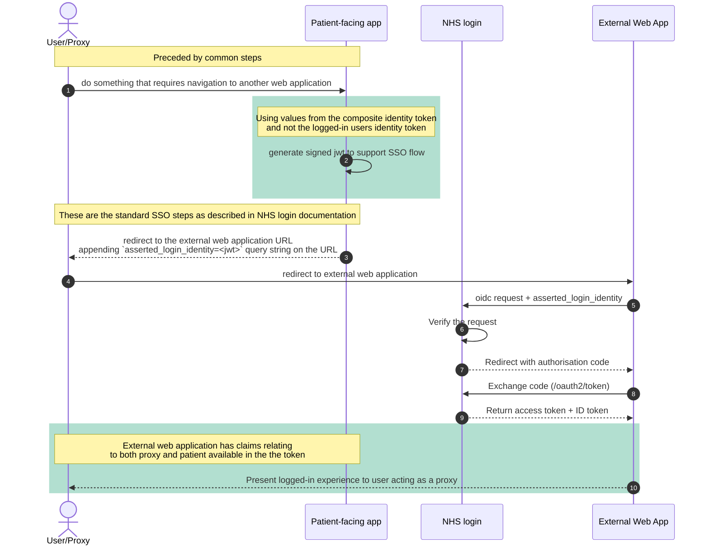
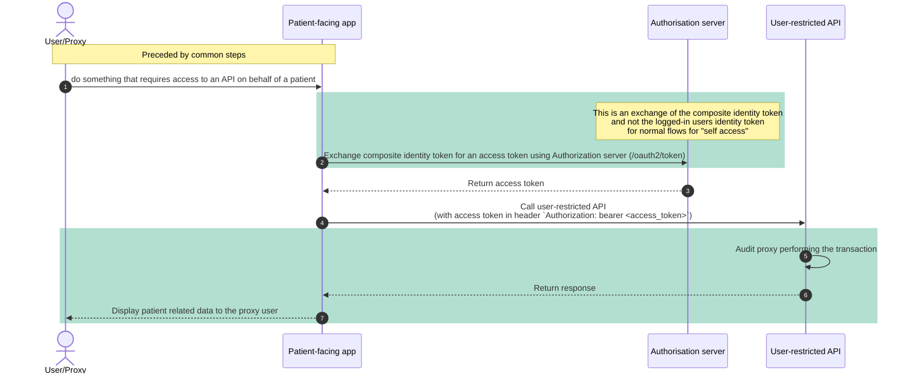



Proxy access to national services is primarily enabled through NHS login, which provides identity assurance and delegated access capabilities for patient-facing applications.

NHS login acts as the federated identity provider for national services. It supports:

- Authentication of the individual user
- Verification of identity to the appropriate level of assurance
- Representation of delegated (proxy) roles
- Secure token issuance for API access

By federating identity and delegation through NHS login, services can rely on a consistent, nationally governed mechanism for determining:

- Who the authenticated user is
- Whether they are acting on their own behalf or as a proxy
- Which patient context applies to subsequent API calls

This approach avoids the need for individual services to implement their own proxy role management and identity verification.

## Fundamental steps of a proxy user journey

When delivering a user journey to enable a proxy to manage services on behalf of a patient, the high-level steps are:

{{ imagePopOut('/assets/images/basic_user_flow.png' | url, 'Proxy user journey') }}

Steps 1-3 will be consistent for all proxy journeys. Step 4 may vary depending on the nature of the transaction that the user wishes to complete.

### Logical Architecture & sequence

{{ imagePopOut('/assets/images/federated_access_generic.png' | url, 'Federated access steps') }}

1. A logged-in user of a patient facing service begins a proxy journey.

2. The patient-facing app (PFS) must request `delegation` scope when initiating the auth code flow to authenticate the user.

3. The PFS will then use the issued access token to query NHS login's `/UserInfo` endpoint. This will trigger NHS login to retrieve all active proxy roles for the logged in user from the Validated Relationships Service (VRS). These are returned as claims in the `delegations` array in the response payload and can be presented to the user for selection.

4. When NHS login retrieves proxy roles, it uses the `GET /Consent` endpoint.

5. The user selects who they would like to "switch to" in the app. The PFS must then perform a token exchange with NHS login. NHS login will issue a composite identity token detailing the `sub`ject and the `act`or, the patient and proxy respectively. This token can then be exchanged for an access token as needed.

6. The user performs a transaction on behalf of the patient they are proxying for. **(i) API Variant:** the PFS performs a [token exchange](https://digital.nhs.uk/developer/guides-and-documentation/security-and-authorisation/user-restricted-restful-apis-nhs-login-separate-authentication-and-authorisation) by calling `/oauth2/token` on the Authorization server to exchange the composite identity token for an access token. The access token is then used in requests to an API in the `Authorization` header (bearer token). The API will verify the token and process the request in the context of the subject in the token, auditing the request appropriately i.e. that the user has performed an action on behalf of the patient. **(ii) Web application Variant:** the user is redirected to an external web application or "web jump off", remaining logged in as a result of an SSO handshake. In doing so the PFS passes the composite identity token in the initial request to the external web application. This is then verified with NHS login through the standard SSO process as described by the [NHS login documentation](https://nhsconnect.github.io/nhslogin/single-sign-on/). The external web application can then provide a logged in experience for the user and use the claims in the token (e.g. NHS number of proxy or patient and demographics of each) as needed.

## Detailed sequence diagrams

Given the two fundamental variants of delivering a proxy user journey (API & Web "jump off"), the below captures the steps involved for each.

  
Where there is variation from the standard process of integrating with NHS login or an API for the logged in user, these steps are highlighted in green.

### 1. Common steps

These initial steps are common to both variants of delivering a proxy user journey.

#### 2.1 Web app jump off steps

The steps described below follow those captured in (1) above when transitioning from one web application to another via SSO.

### 2.2 External API steps

The steps described below follow those captured in (1) above. In order to deliver a proxy journey whereby your patient-facing application uses external APIs to read or write data pertaining to a patient but carried out by a proxy, you can follow the steps outline below.

The below sequence diagram illustrates how the various components interact in order for a proxy user to complete a task involving an external API on behalf of a patient. The flow follows the standard auth flow described in [User-restricted RESTful APIs - NHS login separate authentication and authorisation](https://digital.nhs.uk/developer/guides-and-documentation/security-and-authorisation/user-restricted-restful-apis-nhs-login-separate-authentication-and-authorisation).

## Related documentation

This documentation is meant to act as a guide for how to implement the proxy access workflow into your application. For concrete integration guidance and specifications for the requisite APIs and onboarding processes, you can refer to the following:

- [NHS login developer documentation](https://nhsconnect.github.io/nhslogin/)
- [User-restricted RESTful APIs - NHS login separate authentication and authorisation](https://digital.nhs.uk/developer/guides-and-documentation/security-and-authorisation/user-restricted-restful-apis-nhs-login-separate-authentication-and-authorisation)
